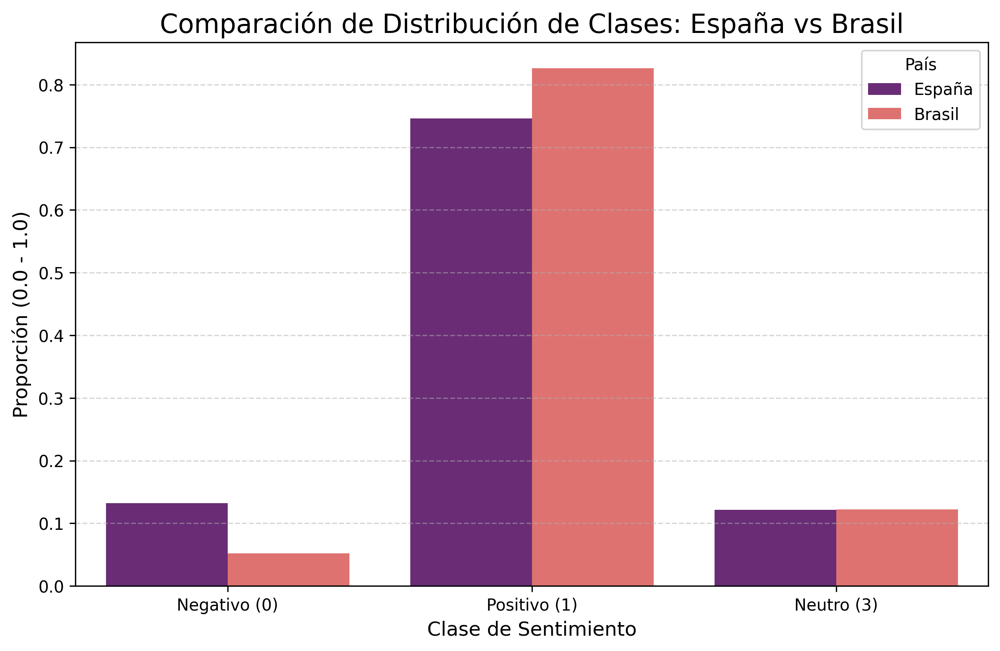
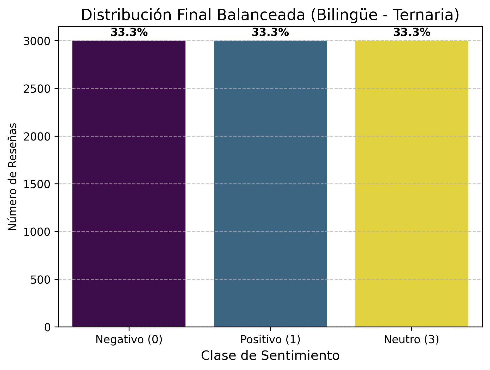

# 🧠 **Review Insight – Data Science - Python - Pipeline Bilingüe**

## 🌟 **Título del Proyecto**

### 🏨 **Clasificación de Sentimiento Bilingüe en Reseñas de Hoteles (MVP Ternario)**

Un Modelo de Producto Mínimo Viable (MVP) diseñado para clasificar automáticamente reseñas de hoteles en **español (España)** y **portugués (Brasil)** en tres categorías: **Positivas (1)**, **Negativas (0)** o **Neutras (3)**, utilizando un enfoque de entrenamiento bilingüe balanceado.

## 📂 **Estructura del Repositorio**

El proyecto sigue una estructura modular estándar para facilitar la colaboración y el despliegue:

```text
├── _pycache_/       # Archivos compilados automáticamente por Python.
├── assets/          # Recursos auxiliares del proyecto (gráficos y visualizaciones).
├── data/            # Datasets de España (CSV) y Brasil (TXT) utilizados para el entrenamiento.
├── models/          # Artefacto serializado del modelo (pipeline bilingüe entrenado).
├── notebooks/       # Notebook de experimentación, análisis exploratorio y evaluación.
├── main.py          # Servidor de inferencia basado en FastAPI para la clasificación.
├── Dockerfile       # Configuración del contenedor para el despliegue (HF Spaces).
├── requirements.txt # Dependencias específicas del entorno de ejecución.
├── MODEL_BEHAVIOR.txt # Informe detallado del comportamiento del modelo.
└── README.md        # Documento principal con la descripción general del proyecto.

```

## 🛠️ **Tecnologías y Librerías**

### ⚙️ **Tecnologías y Dependencias**

- **Lenguaje**: Python (3.x)
- **Análisis y Procesamiento**: Pandas, NumPy, re
- **Machine Learning**: scikit-learn
- **Servidor de API**: FastAPI, Uvicorn
- **Contenedores**: Docker
- **Serialización**: joblib

## 📊 **Análisis Exploratorio de Datos (EDA) y Preprocesamiento**

### 🧹 **Análisis de Datos y Preparación Bilingüe**

#### **4.1. Análisis Inicial del Balance de Clases**

Se integraron dos fuentes de datos internacionales con distribuciones iniciales marcadamente positivas:

- **España**: ~16,356 reseñas (74.6% positivas).
- **Brasil**: ~30,000 reseñas (82.6% positivas).

**Visualización de la Distribución Inicial:**


#### **4.2. Limpieza de Texto y Estrategia de Balanceo**

- **Normalización Bilingüe**: Se aplicó limpieza de caracteres especiales, eliminación de números y conversión a minúsculas para unificar el procesamiento de ambos idiomas.
- **Submuestreo Aleatorio (Undersampling)**: Para eliminar sesgos idiomáticos y de clase, se igualaron las categorías tomando **1,500 muestras por clase para cada país**.
- **Dataset Final**: Totalmente equilibrado con **9,000 registros totales** (4,500 España / 4,500 Brasil).

#### **4.3. Balance Final de Clases (Equilibrado)**

- 🔴 **Negativa (0)**: 3,000 muestras (33.3%)
- 🟢 **Positiva (1)**: 3,000 muestras (33.3%)
- 🟡 **Neutra (3)**: 3,000 muestras (33.3%)

**Visualización del Balance Final:**


## 🧠 **Modelo Entrenado y Evaluación**

### **5.1. Pipeline de Clasificación**

El flujo de trabajo bilingüe se implementó mediante un Pipeline de scikit-learn:

- **Paso 1 (Vectorización)**: `TfidfVectorizer` (N-gramas 1, 2 y filtrado de ruido con `min_df=5`).
- **Paso 2 (Clasificación)**: `LogisticRegression` con solver `lbfgs` para soporte multiclase nativo.

### **5.2. Métricas de Evaluación (Bilingüe)**

- 🔴 **Clase Negativa (0)**: Precision: **0.77** | Recall: **0.81** | F1-Score: **0.79**
- 🟢 **Clase Positiva (1)**: Precision: **0.81** | Recall: **0.81** | F1-Score: **0.81**
- 🟡 **Clase Neutra (3)**: Precision: **0.67** | Recall: **0.63** | F1-Score: **0.65**

### **5.3. Resumen Global**

- 🎯 **Accuracy Global**: **75.17%**
- ⚖️ **Promedio F1-Score (Macro)**: **0.75**

**Matriz de Confusión Bilingüe:**


## 📦 **Artefactos y Uso del Modelo**

### 💾 **6. Artefactos y Contrato de Integración para Despliegue**

#### **6.1. Pipeline Serializado**

El modelo final está listo para clasificar texto crudo en español y portugués sin necesidad de preprocesamiento externo.

- **Archivo**: `sentiment_pipeline_bilingual_multiclass.pkl`
- **Ubicación**: `/models`

#### **6.2. 🌉 Estrategia de Integración (Arquitectura de Microservicios)**

- **Microservicio de Inferencia (Python/FastAPI)**: Aloja el modelo en memoria y expone endpoints REST.
- **Arquitectura**: Desplegado mediante **Docker** para asegurar la paridad entre entornos de desarrollo y producción.

#### **6.3. 📝 Contrato de Interfaz (Comunicación REST)**

- **Endpoint de Inferencia**: `/predict`
- **Método HTTP**: POST

**A. Formato JSON de Entrada (Request)**

```json
{
  "text": "A localização é boa, mas o quarto é bem pequeno e simples."
}
```

**B. Formato JSON de Salida (Response)**

```json
{
  "label": 3,
  "sentiment": "Neutro",
  "confidence": 0.67
}
```

_Este README.md documenta la evolución del modelo hacia un sistema bilingüe internacional, eliminando fronteras idiomáticas y ofreciendo una clasificación de sentimiento robusta y equilibrada._
