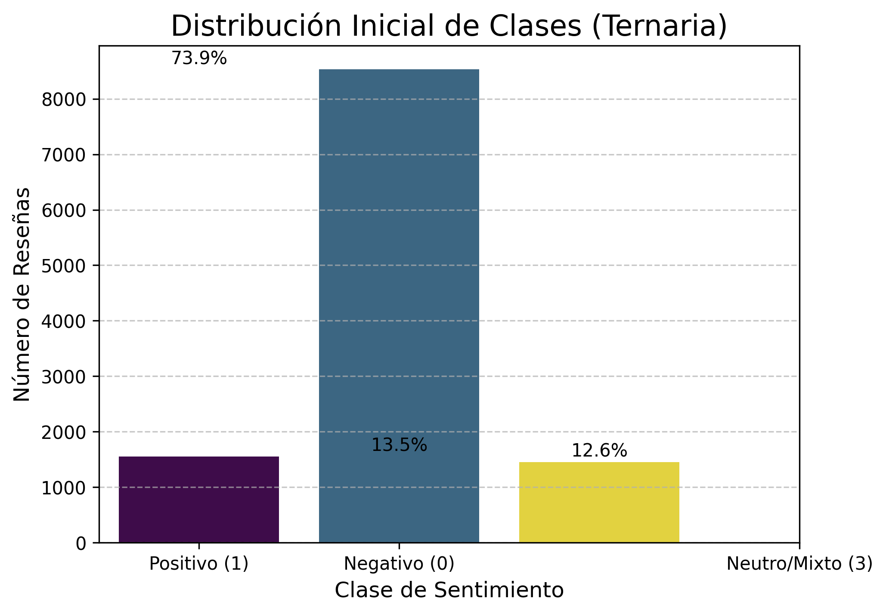
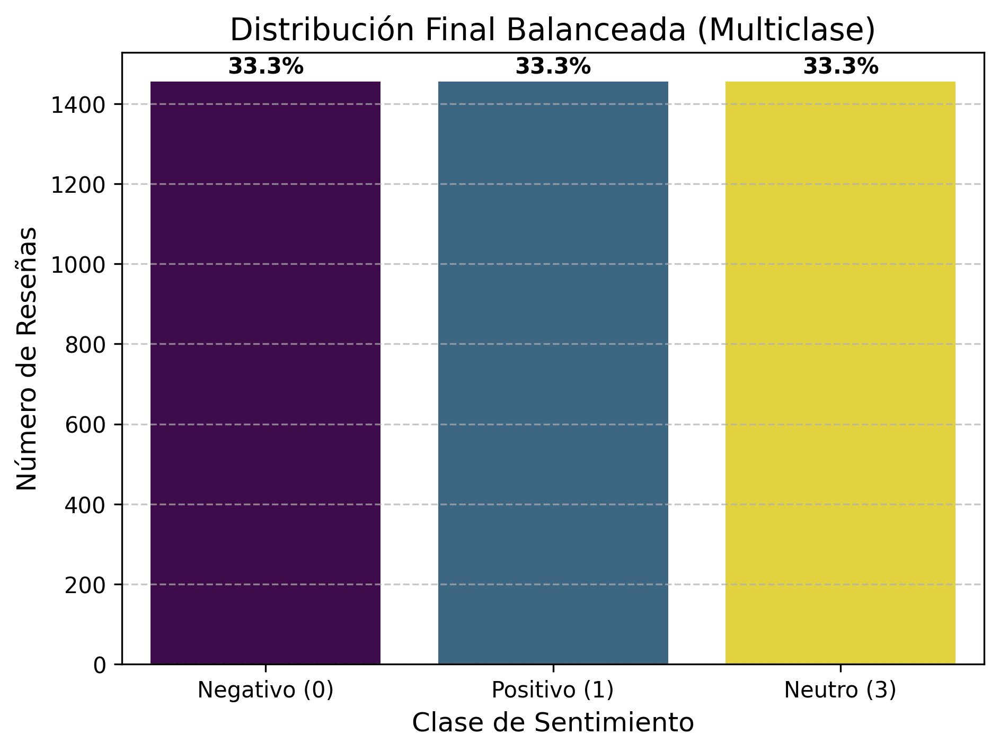
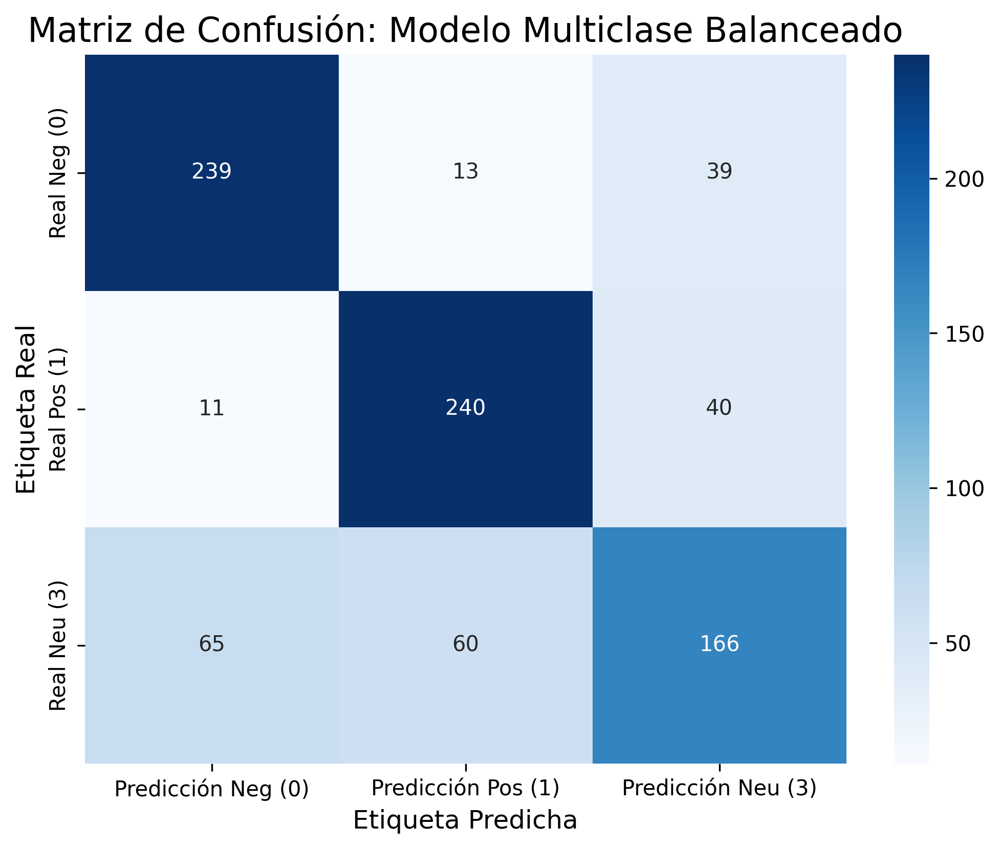

# 🧠 **Review Insight – Data Science - Python - Pipeline**

## 🌟 **Título del Proyecto**

### 🏨 **Clasificación de Sentimiento en Reseñas de Hoteles (MVP Multiclase)**

Un Modelo de Producto Mínimo Viable (MVP) para clasificar automáticamente reseñas de hoteles andaluces en español en tres categorías: **Positivas (1)**, **Negativas (0)** o **Neutras (3)**, utilizando un enfoque de entrenamiento balanceado.

## 📂 **Estructura del Repositorio**

El proyecto sigue una estructura modular estándar para facilitar la colaboración y el despliegue:

```
├── _pycache_/ # Archivos compilados automáticamente por Python para optimizar la ejecución.
├── assets/ # Recursos auxiliares del proyecto (imágenes).
├── data/ # Conjunto de datos utilizados para el entrenamiento, validación y pruebas del modelo(Dataset).
├── models/ # Artefacto serializado del modelo (pipeline multiclase balanceado entrenado).
├── notebooks/ # Notebook de experimentación, análisis exploratorio y evaluación del modelo.
├── main.py # Servidor de inferencia basado en FastAPI para la clasificación de reseñas.
├── Dockerfile # Configuración del contenedor para el despliegue del servicio en la nube (HF Spaces).
├── requirements.txt # Dependencias específicas del entorno de ejecución del proyecto.
├── MODEL_BEHAVIOR.txt # Informe del comportamiento del modelo.
├── README.md # Documento principal con la descripción general del proyecto y sus instrucciones.

```

## 🛠️ **Tecnologías y Librerías**

### ⚙️ **Tecnologías y Dependencias**

- **Lenguaje**: Python (3.x)
- **Análisis y Procesamiento**: Pandas, NumPy, re
- **Machine Learning**: scikit-learn
- **Servidor de API**: FastAPI, Uvicorn
- **Contenedores**: Docker
- **Serialización**: joblib

## 📊 **Análisis Exploratorio de Datos (EDA) y Preprocesamiento**

### 🧹 **Análisis de Datos y Preparación**

#### **4.1. Análisis Inicial del Balance de Clases (Ternario)**

El dataset inicial mostraba un fuerte desbalance y la presencia de la clase 'Neutro (3)':

- **Total de Registros Iniciales**: ~16,356
- **Distribución Ternaria**: La clase Positiva (1) dominaba con ~74%, mientras que la Neutra (3) y la Negativa (0) representaban el resto de manera minoritaria.

**Visualización del Balance Ternario (Inicial):**



#### **4.2. Limpieza de Texto y Estrategia de Balanceo**

- **Limpieza de Texto**: Se aplicó una función de limpieza para unificar el texto (minúsculas, eliminación de puntuación y números).
- **Manejo de Nulos/Duplicados**: Se eliminaron las filas con valores faltantes o duplicados para asegurar la integridad de los datos.
- **Submuestreo Aleatorio (Undersampling)**: Para eliminar el sesgo hacia la clase positiva, se igualaron las tres categorías tomando como referencia la clase con menos muestras (1,455). El dataset final quedó perfectamente equilibrado con **4,365 registros totales**.

#### **4.3. Balance Final de Clases (Equilibrado)**

El dataset final para el entrenamiento contiene una distribución equitativa:

- **Clase Negativa (0)**: 1,455 muestras (33.3%)
- **Clase Positiva (1)**: 1,455 muestras (33.3%)
- **Clase Neutra (3)**: 1,455 muestras (33.3%)

**Visualización del Balance Multiclase (Final)**



## 🧠 **Modelo Entrenado y Evaluación**

### **5.1. Pipeline de Clasificación**

El flujo de trabajo fue implementado mediante un Pipeline de scikit-learn:

- **Paso 1 (Extracción)**: `TfidfVectorizer` (Vectorización de palabras y bi-gramas).
- **Paso 2 (Clasificación)**: `LogisticRegression` (Regresión Logística multiclase).

### **5.2. Métricas de Evaluación**

- **Clase Negativa (0)**: Precision: 0.76 | Recall: 0.82 | F1-Score: 0.79
- **Clase Positiva (1)**: Precision: 0.77 | Recall: 0.82 | F1-Score: 0.79
- **Clase Neutra (3)**: Precision: 0.68 | Recall: 0.57 | F1-Score: 0.62
- **Accuracy Global**: 0.7388

### **5.3. Análisis de la Matriz de Confusión**

A pesar de que el Accuracy global es menor que en modelos desbalanceados, el **Recall de la Clase Negativa subió al 0.82** (comparado con el 0.66 previo). Esto significa que el modelo ahora es mucho más efectivo detectando clientes insatisfechos. La clase **Neutra (3)** presenta el mayor reto, confundiéndose ocasionalmente con los extremos.

**Matriz de Confusión:**



## 📦 **Artefactos y Uso del Modelo**

### 💾 **6. Artefactos y Contrato de Integración para Despliegue**

#### **6.1. Pipeline Serializado**

El modelo final está serializado y listo para clasificar texto crudo en las tres categorías mencionadas.

- **Archivo**: `sentiment_pipeline_logreg.pkl`
- **Ubicación**: `/models`

#### **6.2. 🌉 Estrategia de Integración (Arquitectura de Microservicios)**

Se ha implementado una arquitectura desacoplada para optimizar el rendimiento y la escalabilidad:

- **Microservicio de Inferencia (Python/FastAPI)**: Aloja el modelo `.pkl` en memoria, exponiendo endpoints de alto rendimiento. Se despliega de forma independiente mediante **Docker**.
- **Back-end de Aplicación (Node.js/Express)**: Actúa como orquestador, gestionando la seguridad y comunicándose con el microservicio de IA mediante peticiones HTTP internas.

#### **6.3. 📝 Contrato de Interfaz (Comunicación REST)**

- **Endpoint de Inferencia**: `/predict`
- **Método HTTP**: POST
- **Función**: Clasifica la reseña de forma individual con cálculo de probabilidad.

**A. Formato JSON de Entrada (Request)**

```json
{
  "text": "La ubicación es buena, pero las habitaciones son muy pequeñas."
}
```

**B. Formato JSON de Salida (Response)**

```json
{
  "label": 3,
  "sentiment": "Neutro",
  "confidence": 0.68
}
```

_Este README.md documenta la evolución del modelo hacia un sistema más justo, sensible a las críticas y con una arquitectura de despliegue moderna basada en contenedores._
